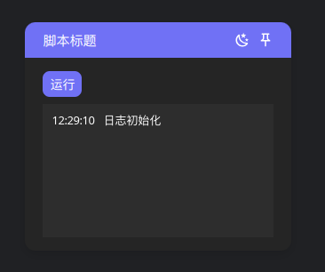

使用Vite、Vue3和TypeScript开发浏览器脚本，集成常用工具库，支持打包为油猴脚本。

<picture>

</picture>

### 更新说明

- 新增 hook-vue.ts 脚本，便于 Vue3 应用逆向。
- 更换 eslint 为 biome，减少依赖，更快。
- vue.ts 新增了若干工具函数。

### 特性

- 基于Vite构建，可充分利用Vite生态插件
- 样式与原网页相互隔离，最大程度减少对原网页的影响
- 使用Unocss，可使用tailwindcss编写样式
- 支持主题定制
- 使用VueUse作为工具库
- 内置脚本窗口和日志组件
- 内置模拟输入和点击脚本
- 支持选择使用jQuery作为DOM操作库
- 可打包为扩展或油猴脚本等形式

### 使用

> 建议使用[bun](https://bun.sh/)

> IDE推荐使用VSCode，并安装项目推荐的插件

```bash
git clone https://github.com/wearzdk/content-script-vue.git # 克隆项目
cd content-script-vue # 进入项目目录
bun install # 安装依赖
bun dev # 启动开发

# 打包为扩展
bun run build
# 打包为油猴脚本
bun run build-tm
```

脚本信息可在`src/manifest.ts`、`package.json`中修改
可在`uno.config.ts`中修改颜色主题配置

### 注意事项

- 脚本css样式将默认限制在脚本容器内，不会影响原网页样式，如须修改可在vite.config.ts中配置要忽略的样式选择器
- 脚本默认运行在主世界（MAIN）中，便于访问所有页面变量，但仅支持Chrome108及以上版本，且无法与background service worker通信，详情查看[chrome script](https://developer.chrome.com/docs/extensions/reference/api/scripting?hl=zh-cn#type-ExecutionWorld)
- 一些现代网站使用虚拟DOM，如Vue、React等，此时使用浏览器原生的点击、输入等操作可能无法触发事件，可使用内置的模拟点击、输入脚本

### 帮助文档

- [Vite](https://cn.vitejs.dev/)
- [Vue3](https://cn.vuejs.org/)
- [Unocss](https://unocss.dev/) Instant On-demand Atomic CSS Engine
- [VueUse](https://vueuse.org/) Vue3组合式API工具库
- [图标库icones](https://icones.js.org/)
- [css class使用图标](https://github.com/antfu/unocss/tree/main/packages/preset-icons)
- [API 自动加载](https://github.com/antfu/unplugin-auto-import) - 直接使用 Composition API 无需引入
